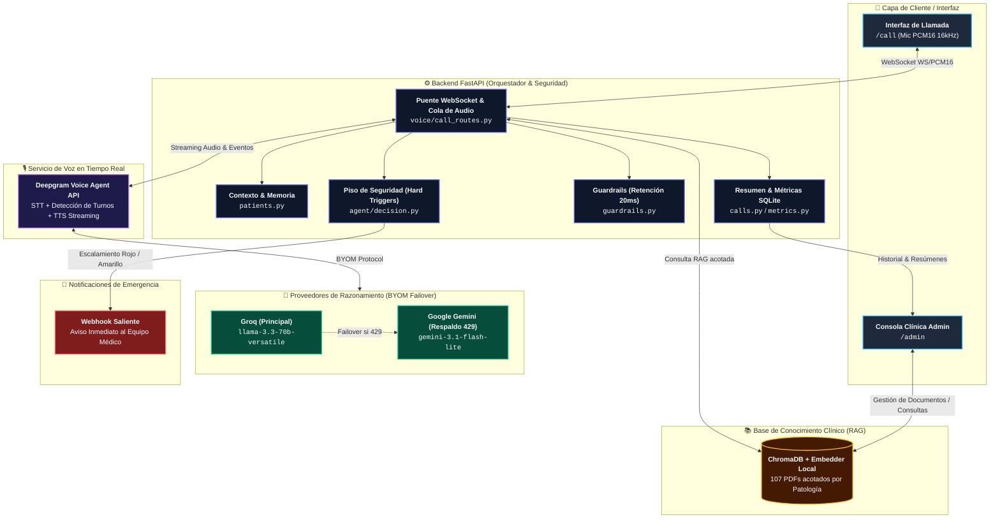

# Arquitectura

## Decisión de modelo (G3)

Familia declarada: **Meta Llama vía Groq**, servida como
`llama-3.3-70b-versatile`. La lista de G3 fija *familias*, no versiones: Groq
descontinuó `llama-3.1-70b-versatile` el 24 de enero de 2025 y este es su
sucesor vigente en el mismo proveedor.

> **Ojo:** `llama-3.3-70b-versatile` tiene baja programada el 16 de agosto de
> 2026. Si el proyecto llega a la final (5 sep 2026), hay que revisar qué
> modelo Llama siga vigente en Groq y actualizar `GROQ_MODEL`.

Se implementó también **Google Gemini gama Flash**, la otra familia de nube
permitida, seleccionable con `THINK_PROVIDER=google`. No es un plan B teórico:
ambos están activos a la vez y el sistema alterna entre ellos (ver *Failover*).

| | Groq · Llama 70B | Google · Gemini Flash |
|---|---|---|
| Latencia | Menor (LPU) | Mayor |
| Límite del tier gratis | 12 000 **tokens**/min | **peticiones**/min |
| Qué lo agota | conversaciones largas | conversaciones con muchos turnos |

Los límites son de naturaleza distinta, y de ahí sale la decisión de
arquitectura más importante del proyecto: **no se agotan a la vez**.

## Voz

Deepgram Voice Agent API resuelve STT streaming, detección de turnos,
interrupciones y TTS. El razonamiento va en modo BYOM contra el proveedor
elegido — Deepgram no gestiona ni Groq ni Google directamente, por eso ambos
exigen `endpoint.url` + `endpoint.headers` con nuestra propia API key.

El audio del micrófono lo lee **una sola tarea** que lo deposita en una cola;
el envío a Deepgram es otra tarea, por sesión. Así una reconexión no deja dos
lectores compitiendo por el mismo socket, y el audio grabado durante el corte
se descarta en vez de dispararse de golpe.

## Failover entre proveedores

Cuando el proveedor activo devuelve 429 (o Deepgram responde `FAILED_TO_THINK`,
que es como se manifiesta), la llamada **no se cae**:

1. Se anota cuándo vuelve a estar libre ese proveedor, leyendo el *retry-after*
   real que él mismo reporta — Groq suele pedir menos de un segundo, Google
   decenas.
2. Se abre sesión nueva con el proveedor que antes esté disponible, no con "el
   siguiente de la lista": volver a uno todavía en enfriamiento gastaba un
   reintento y unos segundos de silencio para reventar otra vez.
3. Se le devuelve al modelo la **memoria de la llamada** (`patients.py::build_memory_prompt`):
   cada sesión de Deepgram arranca en blanco, y sin esto el agente volvía a
   saludar y a preguntar de qué habían operado al paciente.
4. El agente retoma repitiendo en voz alta lo último que le oyó, lo que además
   deja que el paciente corrija una transcripción equivocada.

## Peso asimétrico clínico

Falso negativo (no escalar cuando tocaba) > falso positivo, por rúbrica.
`agent/decision.py` implementa un piso de *hard triggers* — frases de alarma
textuales que fuerzan rojo al margen de lo que decida el LLM. Vive en el
código, no en el prompt, así que **una inyección de prompt no lo alcanza**:
aunque el modelo sea convencido de responder "verde", el nivel final se eleva
igual. `resolve_escalation` nunca relaja un nivel, solo puede subirlo, y un
nivel no reconocido se trata como rojo.

## Qué queda de cada llamada

`calls.py` persiste un registro estructurado —no un párrafo generado por el
LLM— con paciente, procedimiento, día postoperatorio, síntomas textuales,
decisión (incluido el nivel que propuso el modelo si un hard trigger lo
elevó), documentos del corpus que sustentaron las respuestas, próximos pasos y
transcripción. Se muestra al colgar y se consulta en `GET /api/calls`.

Ser estructurado y no generado es deliberado: las referencias quedan
verificables contra la fuente real, no cuesta tokens al final de la llamada, y
no puede alucinar un síntoma ni suavizar una decisión.
