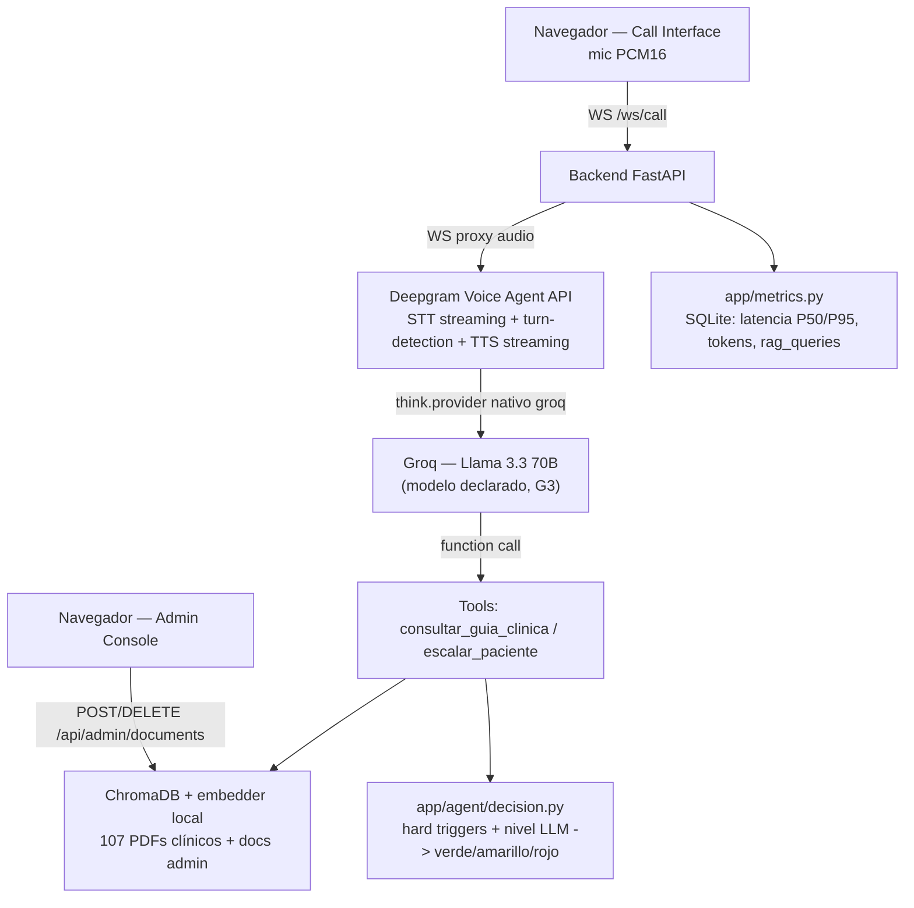

# Arquitectura

## Decisión de modelo (G3)

**Llama 3.1 70B vía Groq** — declarado en el stack cerrado. En la práctica se
sirve como `llama-3.3-70b-versatile`: Groq descontinuó `llama-3.1-70b-versatile`
el 24 de enero de 2025 y ese es su reemplazo directo (mismo linaje Llama 70B
vía Groq, no un cambio de familia de modelo). **Ojo:** `llama-3.3-70b-versatile`
también tiene baja programada el 16 de agosto de 2026 — si el proyecto llega a
finalista (demo en vivo 5 sep 2026), hay que revisar qué modelo Groq 70B esté
vigente en ese momento y actualizar `GROQ_MODEL` en `.env`.

Justificación de Groq sobre las otras 3 opciones del stack: combina latencia
ultra-baja (crítica por el gate G4 de voz en vivo) con capacidad de
razonamiento suficiente para tool calling (RAG + escalamiento). Gemini 1.5
Flash se descartó por el límite de 15 RPM en tier gratuito, riesgo alto en
sesión de evaluación cronometrada en vivo.

## Voz (sin restricción de stack)

Deepgram Voice Agent API con `think.provider.type: "groq"` (proveedor nativo,
no BYOM genérico — Deepgram no gestiona el LLM de Groq directamente, por eso
pide `endpoint.url` + `endpoint.headers` con nuestra propia API key de Groq).
Deepgram resuelve STT streaming, turn-detection e interrupciones, y TTS
streaming — el "pensar" (LLM + tool calling) lo hace Groq. Evita reconstruir
VAD/interrupciones desde cero.

## Peso asimétrico clínico

Falso negativo (no escalar cuando tocaba) > falso positivo, por rúbrica.
`app/agent/decision.py` implementa un piso de "hard triggers" (frases de
alarma textual) que fuerza rojo independiente de lo que decida el LLM, y
`resolve_escalation` nunca relaja el nivel — solo puede subirlo.
