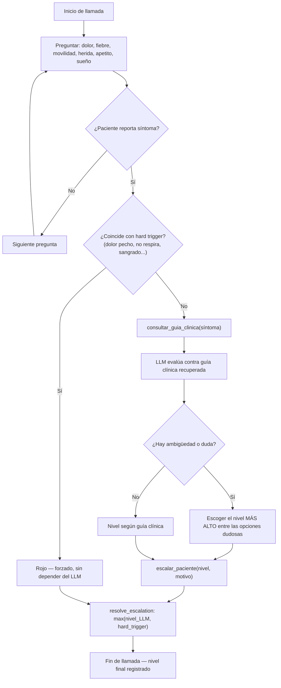

# Flujo de decisión del agente

```mermaid
flowchart TD
    START["Inicio de llamada"] --> ASK["Preguntar: dolor, fiebre, movilidad, herida, apetito, sueño"]
    ASK --> SYM{"¿Paciente reporta síntoma?"}
    SYM -->|No| NEXT["Siguiente pregunta"]
    NEXT --> ASK
    SYM -->|Sí| HARD{"¿Coincide con hard trigger?<br/>(dolor pecho, no respira, sangrado...)"}
    HARD -->|Sí| RED["Rojo — forzado, sin depender del LLM"]
    HARD -->|No| RAG["consultar_guia_clinica(síntoma)"]
    RAG --> EVAL["LLM evalúa contra guía clínica recuperada"]
    EVAL --> DUDA{"¿Hay ambigüedad o duda?"}
    DUDA -->|Sí| ESCALA_ARRIBA["Escoger el nivel MÁS ALTO entre las opciones dudosas"]
    DUDA -->|No| NIVEL["Nivel según guía clínica"]
    ESCALA_ARRIBA --> CALL_TOOL["escalar_paciente(nivel, motivo)"]
    NIVEL --> CALL_TOOL
    CALL_TOOL --> COMBINE["resolve_escalation: max(nivel_LLM, hard_trigger)"]
    RED --> COMBINE
    COMBINE --> END["Fin de llamada — nivel final registrado"]
```

Regla no negociable: ante empate o ambigüedad entre dos niveles, se escoge
siempre el más alto. El sistema nunca "tranquiliza por defecto".
